  <picture>
    <source media="(prefers-color-scheme: dark)" srcset="assets/logo-anim-dark.svg">
    
  </picture>

[ Main](README.md) | [ Security](SECURITY.md) | [ Contributing](CONTRIBUTING.md) | [ Code of Conduct](CODE_OF_CONDUCT.md) | [ D-ARX Core Spec](https://github.com/Kryklin/darkstar)

<h1 align="center">Security Policy</h1>

Darkstar Vault is a defense-grade sovereign security enclave. We prioritize the absolute isolation, mathematical integrity, and memory zeroization of our cryptographic pipelines and the privacy of our users.

---

##  Sovereign Post-Quantum Enclave Model

Darkstar Vault interfaces directly with the native sovereign **D-ARX-512** cryptographic core from [kryklin/darkstar](https://github.com/Kryklin/darkstar). Our security architecture enforces:

- **Zero-Knowledge Memory Architecture**: Master keys, passphrases, and decrypted payloads exist solely in volatile, scrubbed execution memory and are never serialized to unencrypted disk caches.
- **Hardware Enclave Binding**: High-assurance authentication leverages platform secure enclaves (TPM 2.0 via Windows Hello, Apple Secure Enclave via Touch ID / Face ID, and Android BiometricPrompt).
- **OS-Level Secret Storage**: Cached session credentials utilize Electron `safeStorage` (Windows DPAPI, macOS Keychain, Linux Libsecret) ensuring process-isolated protection.
- **Pure Native Delegation**: 100% of stream cipher permutation, key schedule expansion, and CTR keystream operations are executed by pre-compiled native `d-arx` binaries with runtime binary signature and SHA-512 integrity checks.
- **Air-Gapped Operational Model**: Supports end-to-end air-gapped data transfers via animated QR-code streams and steganographic data carriers.

---

##  Supported Versions

| Version | Supported | Security Standard | Enclave Isolation |
| :--- | :--- | :--- | :--- |
| **3.0.x** |  Active | D-ARX-512 Core Stream Cipher / FIDO2 WebAuthn | Enforce Hardware Attestation |
| **< 3.0** |  End of Life | Legacy Pre-release Implementations | Deprecated |

---

##  Reporting a Vulnerability

> [!IMPORTANT]
> **Please do not report security vulnerabilities through public GitHub issues.**

If you discover an architectural weakness, memory leakage vector, or cryptographic implementation flaw, please submit an encrypted security report to:

**<kalemslight@gmail.com>**  
*(Alternative security point of contact: `<mortalpain1@gmail.com>`)*

### What to include in your advisory:

1. **Vulnerability Overview**: Clear description of the exploit vector and severity assessment.
2. **Reproduction Steps**: Step-by-step instructions or minimal Proof of Concept (PoC).
3. **Affected Environment**: Platform (Windows, macOS, Linux, Android, iOS), client version, and hardware configuration.
4. **Impact Assessment**: Evaluation of potential impact on memory safety or enclave boundary traversal.

### Disclosure Timeline & SLA

- **Initial Acknowledgement**: Within **48 hours**.
- **Triage & Reproduction**: Within **7 business days**.
- **Patch Deployment**: Coordinated release schedule with private advisory until public deployment.

---

##  Security Guarantees & Auditability

- **No Backdoors**: Darkstar Vault contains no administrative backdoors, master bypass keys, or escrow mechanisms.
- **Zero Telemetry**: We collect zero telemetry, analytical beacons, network tracking, or usage metrics.
- **Fully Verifiable Builds**: All source files and build pipelines produce verifiable artifacts with deterministic SHA-256 / SHA-512 integrity checksums.

---

[ Main](README.md) | [ Security](SECURITY.md) | [ Contributing](CONTRIBUTING.md) | [ Code of Conduct](CODE_OF_CONDUCT.md) | [ D-ARX Core Spec](https://github.com/Kryklin/darkstar)

